<div align="center">


<br/>

<p>
  
  
  
  
</p>

<a href="https://git.io/typing-svg"></a>

<br/><br/>

<table>
  <tr>
    <td align="center"></td>
    <td align="center"></td>
    <td align="center"></td>
  </tr>
</table>

<br/>

<p>
  <a href="#-features"></a>
  <a href="#-screenshots"></a>
  <a href="#-installation"></a>
  <a href="#-supabase-setup"></a>
  <a href="#-hardware-flow"></a>
</p>

</div>

<br/>


## 🎯 Problem Statement

<div align="center">
  
</div>

<br/>

Students need quick, reliable visibility into the safety of campus drinking water. Traditional water-quality checks are often slow, manual, and not easily accessible to students. AquaSense UJ solves this by combining a mobile app, Supabase backend, real-time readings, reporting tools, and planned ESP32 sensor nodes.

## 💡 The Solution

<div align="center">
  
</div>

<br/>

**AquaSense UJ** is a React Native + Expo mobile application that helps students and admins monitor campus water quality. The app connects to Supabase for authentication, PostgreSQL storage, realtime updates, role-based access, CRUD operations, alerts, reports, and map-based station visibility.

AquaSense does **not** purify water. It detects, records, alerts, and helps escalate water-quality issues to the relevant facilities or maintenance teams.

<br/>


## ⚡ Features

<table>
  <tr>
    <td width="50%" valign="top">

### 👤 Student Features

```diff
+ Real registration and login using Supabase Auth
+ Forgot password email flow
+ Password visibility eye icon
+ Edit profile information
+ Upload/update profile picture using Supabase Storage
+ View water status dashboard
+ View pH, TDS, turbidity, and temperature readings
+ See campus water stations on a real map
+ Submit water issue reports
+ Track hydration intake
+ View impact and service information
+ Logout securely
```

### 🗺️ Campus Map

```yaml
Map Features:
  Provider: Google Maps / react-native-maps
  Data Source: Supabase nodes table
  Markers: Water stations / sensor nodes
  Status: SAFE, CAUTION, UNSAFE
  Use Case: Find nearby monitored water points
```

### 🚨 Alerts

- Unsafe readings trigger alert records automatically.
- Admins can view, resolve, or delete alerts.
- In-app alerts work immediately.
- Push notifications require a development build/APK because Expo Go has SDK 54 notification limitations.

</td>
<td width="50%" valign="top">

### 🛠️ Admin Features

```diff
+ Same login screen for students and admins
+ Role-based routing using public.users.role
+ Admin dashboard overview
+ User CRUD where appropriate
+ Add user through secure Supabase Edge Function
+ Edit user profile, campus, role, and status
+ Suspend/activate users
+ Delete users through secure Supabase Edge Function
+ Create, read, update, and delete stations/nodes
+ Manage reports: Pending → In Progress → Resolved
+ Manage alerts
```

### 📊 Backend CRUD Coverage

| Area | Backend Support |
|---|---|
| Auth | Register, login, logout, reset password |
| Users | View, edit, suspend, activate, admin create/delete |
| Stations | Create, read, update, delete |
| Reports | Create, read, update status, delete |
| Hydration Logs | Create, read, update, delete |
| Alerts | Automatic create, read, resolve, delete |
| Readings | Sensor/system insert, realtime read |

</td>
  </tr>
</table>

<br/>


## 📸 Screenshots

<div align="center">
  
</div>

<br/>

### 🔐 Login & User Dashboard

<div align="center">
  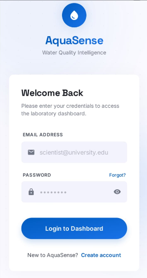
  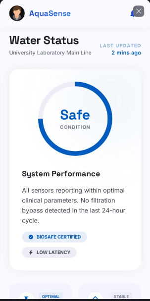
  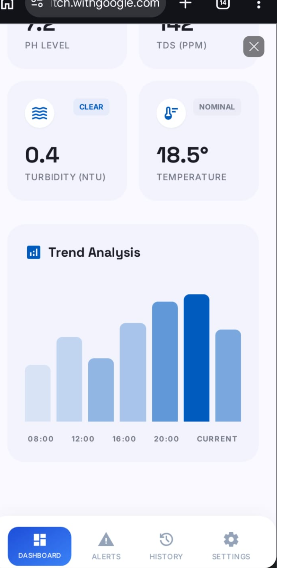
</div>

<br/>

<div align="center">
  
  
  
  
</div>

<br/>

### 🗺️ Map, Reports & Community Feed

<div align="center">
  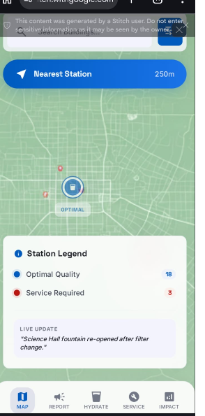
  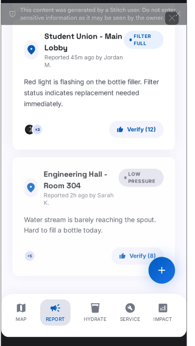
  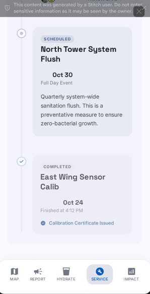
</div>

<br/>

### 🌍 Impact & Settings

<div align="center">
  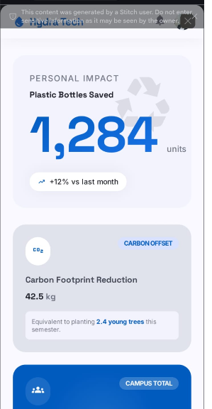
  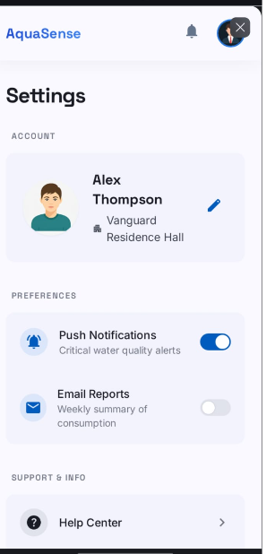
</div>

<br/>


## 🛠️ Tech Stack

<div align="center">

### Frontend
<p>
  
</p>

### Backend & Tools
<p>
  
</p>

### Mobile Development
<p>
  
</p>

</div>

<br/>

<table width="100%">
  <tr>
    <td width="33%" valign="top">

**Frontend**
- React Native 0.81.5
- Expo SDK 54
- JavaScript
- React Navigation-style custom flow
- Expo Image Picker
- Expo Notifications
- React Native Maps

</td>
<td width="33%" valign="top">

**Backend**
- Supabase Auth
- Supabase PostgreSQL
- Supabase Storage
- Supabase Realtime
- Supabase Edge Functions
- Row-Level Security policies

</td>
<td width="33%" valign="top">

**IoT / Hardware Flow**
- ESP32-WROOM-32
- pH sensor
- TDS sensor
- Turbidity sensor
- DS18B20 temperature sensor
- Arduino IDE firmware
- HTTPS POST to Supabase

</td>
  </tr>
</table>

<br/>


## 📦 Installation

<div align="center">
  
  
  
</div>

<br/>

### Prerequisites

- Node.js 18+
- npm
- Expo Go for SDK 54, or an Expo development build
- Android Studio emulator or a physical Android phone
- Supabase project
- Google Maps API key for Android maps

### Quick Start

```bash
# Install dependencies
npm install

# Start Expo with clean cache
npx expo start -c

# Open on Android emulator
# Press "a" after Metro starts
```

### Environment Variables

Create a `.env` file in the root directory:

```env
EXPO_PUBLIC_SUPABASE_URL=https://your-project-id.supabase.co
EXPO_PUBLIC_SUPABASE_ANON_KEY=your-supabase-publishable-key
EXPO_PUBLIC_GOOGLE_MAPS_ANDROID_API_KEY=your-google-maps-android-key
```

> Do **not** commit `.env` to GitHub. Use `.env.example` as the safe template.

<br/>


## 🟢 Supabase Setup

### 1. Create the Database

Run these SQL files in Supabase SQL Editor, in this order:

```txt
supabase/schema.sql
supabase/seed.sql
supabase/upgrade_user_crud_alerts.sql
```

### 2. Enable Authentication

In Supabase:

```txt
Authentication → Providers → Email
```

Enable email/password authentication.

### 3. Promote Yourself to Admin

Register normally in the app first, then run:

```sql
update public.users
set role = 'admin'
where lower(email) = lower('your-email@example.com');
```

Logout and login again. The app will route you to the admin side.

### 4. Deploy Edge Functions

Install the Supabase CLI locally:

```bash
npm install supabase --save-dev
```

Login and link the project:

```bash
npx supabase login
npx supabase link --project-ref your-project-ref
```

Deploy admin functions:

```bash
npx supabase functions deploy admin-create-user
npx supabase functions deploy admin-delete-user
```

Optional automation functions:

```bash
npx supabase functions deploy evaluate-reading
npx supabase functions deploy send-push-alert
npx supabase functions deploy daily-aggregation
```

<br/>


## 🔌 Hardware Flow

<div align="center">

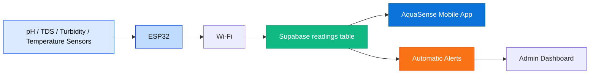

</div>

The physical sensors connect to the **ESP32**, not directly to the app. The ESP32 reads water values, connects to Wi-Fi, sends JSON readings to Supabase, and the app updates from Supabase Realtime.

### Planned ESP32 Sensor Pins

| Sensor | ESP32 Pin | Purpose |
|---|---:|---|
| pH sensor | GPIO34 | Water acidity/alkalinity |
| TDS sensor | GPIO35 | Dissolved solids/salts/metals |
| Turbidity sensor | GPIO32 | Water clarity |
| DS18B20 temperature | GPIO4 | Temperature compensation |

### Reading Payload Example

```json
{
  "node_id": "11111111-1111-1111-1111-111111111111",
  "ph": 7.2,
  "tds": 142,
  "turbidity": 0.4,
  "temperature": 18.5,
  "sans_status": "SAFE"
}
```

<br/>


## 🎮 How It Works

<div align="center">

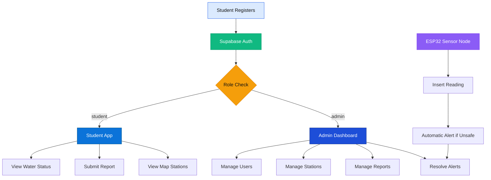

</div>

### For Students

1. Register using email and password.
2. Select campus/profile details.
3. View live water-quality readings.
4. Use the map to view monitored water points.
5. Submit reports for smell, taste, colour, pressure, or service issues.
6. Track hydration and impact.
7. Edit profile and upload a profile picture.

### For Admins

1. Login using the same login screen.
2. App checks `public.users.role`.
3. Manage users, stations, reports, readings, and alerts.
4. Set reports to **Pending**, **In Progress**, or **Resolved**.
5. Add/delete users securely through Supabase Edge Functions.

<br/>


## 📊 Key Database Tables

| Table | Purpose |
|---|---|
| `users` | User profiles, roles, campus, avatar, status |
| `nodes` | Water stations/sensor locations |
| `readings` | pH, TDS, turbidity, temperature, SANS status |
| `alerts` | Unsafe/caution water-quality alerts |
| `reports` | Student issue reports |
| `hydration_logs` | User hydration tracking |
| `readings_daily` | Aggregated trend/history readings |

<br/>

## 🔐 Security Notes

<div align="center">

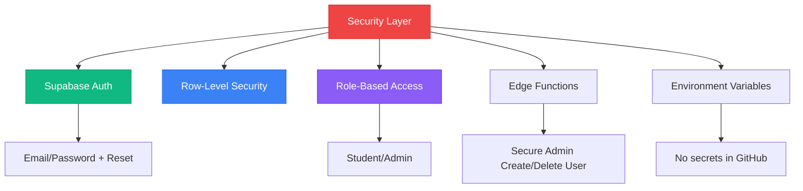

</div>

- The mobile app uses only public/publishable Supabase keys.
- Service role secrets stay inside Supabase Edge Functions only.
- Admin delete/create user actions are not performed directly from the mobile app.
- `.env` is ignored by Git and must not be committed.

<br/>

## 🧪 Testing Checklist

| Feature | Expected Result |
|---|---|
| Register | User appears in Supabase Auth and `public.users` |
| Login | Student routes to student dashboard |
| Admin role | Admin routes to admin dashboard |
| Add User | User appears in Supabase Auth and `public.users` |
| Delete User | User removed/deactivated through Edge Function |
| Submit Report | Row appears in `reports` table |
| Update Report | Status updates to In Progress/Resolved |
| Add Station | Marker appears on map and `nodes` table |
| Unsafe Reading | Alert appears automatically |
| Edit Profile | Name/campus/avatar update persists |
| Forgot Password | Reset email is sent by Supabase |

<br/>

## 🏗️ Building for Production

### Development Build / APK

```bash
npx expo install expo-dev-client
npx expo run:android
```

### EAS Build

```bash
npm install -g eas-cli
eas login
eas build:configure
eas build --platform android --profile preview
```

> Full Android push notifications require a development build or APK. Expo Go SDK 54 does not fully support Android remote push notifications.

<br/>

## 🗺️ Roadmap

<div align="center">

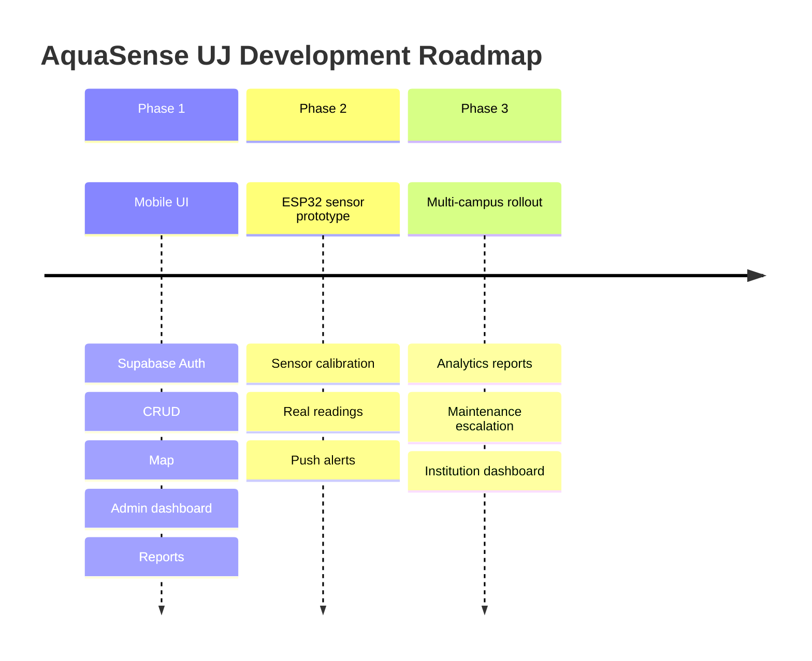

</div>

### ✅ Phase 1: App + Backend Complete
- ✅ Student registration and login
- ✅ Role-based admin/user routing
- ✅ Supabase database tables
- ✅ CRUD for users, stations, reports, hydration logs, and alerts
- ✅ Real map integration
- ✅ Profile editing and image upload
- ✅ Forgot password
- ✅ Edge Functions for admin create/delete user

### 🚧 Phase 2: Hardware Integration
- 🚧 Buy ESP32 and sensors
- 🚧 Test Wi-Fi posting to Supabase
- 🚧 Connect one sensor at a time
- 🚧 Calibrate pH, TDS, turbidity, and temperature readings
- 🚧 Confirm live readings update the app

### 🔮 Phase 3: Scaling
- 🔮 More campus nodes
- 🔮 Analytics dashboard for facilities
- 🔮 Scheduled compliance reports
- 🔮 Automated maintenance escalation

<br/>

## 👥 Team

<div align="center">
  
  
  
</div>

<br/>

| Role | Responsibility |
|---|---|
| Frontend / Mobile App | React Native screens, navigation, UI implementation |
| Backend Integration | Supabase Auth, CRUD, Realtime, Edge Functions |
| Hardware / IoT | ESP32 sensor node, sensor wiring, calibration, firmware |
| Documentation | README, technical setup, testing evidence, presentation support |

<br/>

## 📄 License

<div align="center">
  
</div>

This project is built for educational and innovation project purposes at the University of Johannesburg.

<br/>

## 🙏 Acknowledgments

- **University of Johannesburg** — innovation project context and campus relevance
- **Supabase** — backend, database, auth, storage, realtime, and Edge Functions
- **Expo** — React Native development workflow
- **Google Maps Platform** — map display and station visibility
- **AdBeam Team** — project collaboration and design direction

<br/>

## 🌍 Impact Statement

<div align="center">

> *"AquaSense makes invisible water-quality risks visible, giving students and campus teams faster insight into drinking-water safety."*

<br/>


</div>

<br/>


